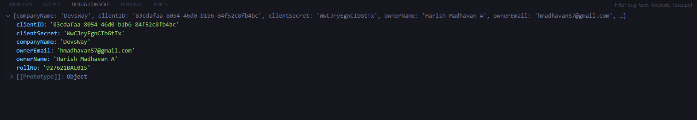

# Average Calculator

This Average calculator is based on API register microservice where this project covers only frontend using React

## Register API 

To register the API service , run the **api.html** and replace the CODE #9 with your endpoint and from CODE #15 to CODE #19 replace with your Credentials.


## Installation

1. Create a new folder for this front-end application:

     ```bash
   mkdir Front-End-App
   ```

2. Initialize a new Vite project:

    ```bash
   npm init vite@latest
    ```

Enter your project name.
Select React as the framework.
Choose JavaScript as the language.

3. Navigate to the project folder:

     ```bash
   cd Front-End-App

4. Install dependencies:

    ```bash
    npm install
    npm install axios bootstrap
    ```

5. Start the client : 

    ```bash
    npm run dev    
    ```

### ScreenShot


#### API register


#### Desktop_View


#### Mobile_View
